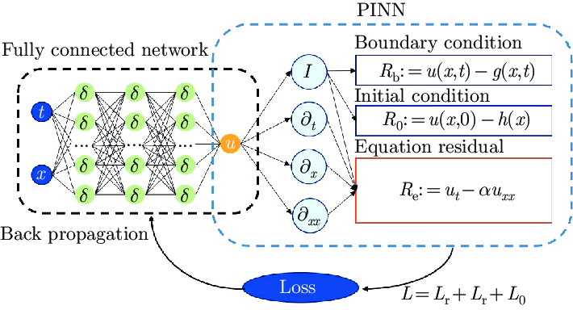

# Physics-Informed Neural Networks (PINNs) Exploration



Welcome to my GitHub repository showcasing my exploration into **Physics-Informed Neural Networks (PINNs)**. This repository highlights my understanding of PINNs and how they can be applied to solve differential equations, starting with a beginner-friendly implementation. 

Note -> Kindly read Documentation.pdf for basics.

## About This Repository
In this repository, I:

- Implement a simple PINN to solve various Equation.
- Explore the process of defining a neural network, boundary conditions, and loss functions that incorporate the physical equations.
- Gain a foundational understanding of how PINNs work and how to approach more complex problems in the future.

## Getting Started
To execute the code in this repository, follow the steps below:

### 1. Clone the Repository
```bash
$ git clone https://github.com/KshitijAng/Physics-Informed-Neural-Networks-PINN-.git
$ cd Physics-Informed-Neural-Networks-PINN-
```

### 2. Create a Virtual Environment
It is recommended to use a virtual environment for dependency management. To create and activate a virtual environment:


#### On Windows:
```bash
$ python -m venv venv
$ venv\Scripts\activate
```

### 3. Install Required Libraries
Make sure you have [**PyTorch**](https://pytorch.org/) installed. Install the dependencies by running:

```bash
$ pip install torch numpy matplotlib
```

### 4. Run the Code
Once the environment is set up, execute the script to see the PINN solving the Burgers' equation.
```bash
$ python main.py
```

## What You'll Learn
- The basic structure of a PINN.
- How to incorporate Partial Differential Equations (PDEs) into a neural network's loss function.
- Insights into the Burgers' equation as a test case.

## Why This Repository?
This repository serves as:

- A demonstration of my understanding of PINNs.
- A starting point for diving deeper into physics-informed machine learning.

## Future Work
In the future, I aim to:

- Expand this exploration to 2D and 3D PDEs.
- Experiment with more complex physical systems and constraints.
- Optimize training methods for faster convergence and higher accuracy.

## Feedback and Collaboration
Feel free to explore, fork, and provide feedback on this repository. Collaboration and suggestions are always welcome!

---

### Author
**Kshitij Angurala**

This repository reflects my journey into understanding and implementing PINNs as a beginner. Thank you for visiting!
